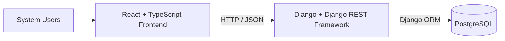
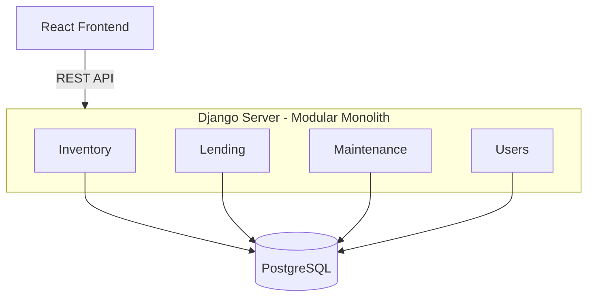
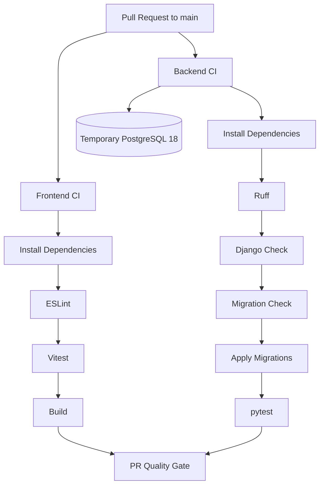

# ECE Equipment Management System Architecture

## 1. Purpose

This document explains how the ECE Equipment Management System (EMS) is structured, why the main architectural decisions were made, and what those decisions mean for developers working on the project.

The goal is to keep the system simple enough for a small team to work on comfortably, while leaving clear room for the application to grow as requirements evolve.

---

## 2. High-Level Architecture

The EMS uses a web application architecture with a React frontend, a Django REST backend, and PostgreSQL for data storage.



The frontend communicates with the backend through a REST API. The frontend does not connect directly to PostgreSQL.

This separation keeps user interface concerns, application logic, and data storage independent from each other.

---

## 3. Repository Structure

The project uses a monorepo.

```text
ECE-equip-manager/
├── frontend/
├── server/
├── docs/
├── .gitignore
└── README.md
```

### Why a monorepo?

The frontend and backend are parts of the same application and are developed by the same team. Keeping them in one repository gives us:

- one source of truth for the project
- one place for pull requests and code review
- easier coordination between frontend and backend changes
- shared documentation
- one CI workflow

The root `.gitignore` covers generated files, local environments, dependencies, caches, build output, editor files, and secrets for both the frontend and backend.

Local `.env` files must not be committed. Safe templates such as `.env.example` should be committed.

---

## 4. Git and Collaboration Workflow

### Main branch

`main` is the shared integration branch.

Developers should not work directly on `main`. Work should be completed on short-lived branches and merged through pull requests.

### Branch naming

Use names that describe the type of work:

```text
feature/<description>
fix/<description>
test/<description>
docs/<description>
chore/<description>
```

Example:

```text
feature/equipment-search
```

### Standard developer workflow

Start from the latest `main`:

```bash
git switch main
git pull origin main
git switch -c feature/equipment-search
```

Make changes and commit them:

Use brief, clear commit messages that describe the change, such as `Add equipment search`. Stage only intended files.

```bash
git status
git add <intended-files>
git commit -m "Add equipment search endpoint"
```

After completing branch work and before pushing, fetch and merge the latest `main` while on the feature branch:

```bash
git fetch origin
git merge origin/main
```

If conflicts occur, the agent explains the competing changes and proposes a resolution. Obtain explicit user approval before editing conflicted files or completing the resolution. After integration, rerun affected checks and review the diff before pushing.

Push the branch when authorized by the user or approved workflow:

```bash
git push -u origin feature/equipment-search
```

After the first push:

```bash
git push
```

The user creates the pull request into `main` in GitHub. The agent supplies a suggested title, change summary, validation results, and remaining actions rather than creating the PR automatically.

The pull request should explain:

- what changed
- why it changed
- how it was tested

A pull request should not be merged until required CI checks pass and the required review is complete.

After merge:

```bash
git switch main
git pull origin main
git branch -d feature/equipment-search
```

### Merge strategy

Use the [PR template](../.github/pull_request_template.md) to record validation and dependencies. Follow [Quality.md](Quality.md) for planning approval, split feature work, acceptance testing, and the Definition of Done. CI and code review are merge gates; the parent feature is Done only after integration, passing acceptance tests, and Product Owner acceptance.

Use squash merge for pull requests.

This keeps `main` easier to read by turning the work from one feature branch into one meaningful commit.

### Conflict resolution

A Git conflict may look like this:

```text
[start of current-branch version]
your version
[separator between versions]
their version
[end of version from origin/main]
```

Do not remove conflict markers blindly.

Understand both versions and propose the final behavior. After the user approves the resolution, remove the markers, run affected tests and linting, and commit with a brief, clear message.

### Team communication

The Microsoft Teams group is the team's primary communication channel for Git and pull request coordination.

When opening a pull request that touches shared or commonly edited areas, notify the team.

If another developer needs to change the same files or functionality while that pull request is open, they should communicate with the pull request author first.

The goal is not to stop development whenever a pull request is open. The goal is to avoid duplicated work, unexpected overlap, and preventable merge conflicts.

A useful rule to remember is:

> Git tells us what changed. Teams tells us what people are currently working on.

---

## 5. Frontend Architecture

### Technology

The frontend uses:

- React
- TypeScript
- Vite
- Tailwind CSS
- React Router
- Node.js 24
- npm
- ESLint
- Vitest

Tailwind CSS is configured through `@tailwindcss/vite` and `frontend/src/index.css`. React Router uses declarative routing with `BrowserRouter` and `frontend/src/AppRoutes.tsx`. The initial `/` route shows the health-check page; unknown paths show a fallback page.

### State management

The frontend will initially use React's built-in state management.

This includes tools such as:

```text
useState
useContext
```

A dedicated state management library should only be introduced if the application develops a clear need for more complex shared client-side state.

The server remains the source of truth for EMS data such as equipment, borrowers, loans, and maintenance records.

### Styling

Use Tailwind utility classes for component styling. Existing global CSS is kept in the base layer in `frontend/src/index.css`, so utility classes can override it.

Reusable UI components should be created when the same pattern appears repeatedly, but we should avoid creating unnecessary abstractions for very small pieces of UI.

### Routing

React Router manages frontend navigation. Add routes in `frontend/src/AppRoutes.tsx` and use `Link` or `NavLink` for internal navigation. The frontend host must serve `index.html` for client-side routes on direct requests; API requests must still reach Django.

Future business routes may include (these are not implemented yet):

```text
/login
/dashboard
/equipment
/equipment/:id
/borrowers
/loans
/maintenance
/analytics
```

The final route structure can evolve with the application.

### Frontend checks

Developers should be able to run the same checks locally that CI runs:

```bash
npm run lint
npm test -- --run
npm run build
```

---

## 6. Backend Architecture

### Technology

The backend uses:

- Python 3.14
- Django 6.1.1
- Django REST Framework
- pip with `requirements.txt`
- Ruff
- pytest
- pytest-django

The local Python environment is created with `.venv`.

The virtual environment must not be committed.

---

## 7. Backend Organization

### Architecture style

The Django backend follows a modular monolith approach.

This means the backend remains one application and is deployed as one unit, but the code is divided into meaningful business areas.



Initial business areas are:

- **Inventory**: equipment categories, equipment types, and individual assets
- **Lending**: borrowers, loans, returns, and lending history
- **Maintenance**: maintenance records and maintenance workflows
- **Users**: users, authentication, roles, and permissions

### Why a modular monolith?

A single large Django app would be simple at first, but could become difficult to navigate as more features are added.

At the other extreme, creating a separate Django app for every model or small feature would add unnecessary structure.

A modular monolith gives us a middle ground:

- one backend
- one deployment
- one database
- clear internal areas of responsibility
- room to reorganize individual areas as they grow

Analytics and exports do not need to be separate modules immediately. They can be separated later if they become large or independent enough to justify it.

### For developers

Place backend functionality in the module that owns the business responsibility.

Examples:

```text
Add an equipment status field     -> inventory
Implement equipment checkout      -> lending
Record a repair                    -> maintenance
Add a new user permission          -> users
```

Do not create a new Django app for every model or small feature.

---

## 8. API Conventions

### Base URL

The API is not versioned initially.

Use:

```text
/api/
```

Examples:

```text
/api/equipment/
/api/equipment/{id}/
/api/borrowers/
/api/borrowers/{id}/
/api/loans/
/api/loans/{id}/
```

Resource names should normally use plural nouns.

### HTTP methods

Use standard HTTP methods according to their normal meaning:

| Method | Purpose |
| --- | --- |
| `GET` | Retrieve data |
| `POST` | Create a resource |
| `PATCH` | Partially update a resource |
| `PUT` | Replace a resource when a full replacement is actually needed |
| `DELETE` | Delete a resource |

`PATCH` will usually be preferred over `PUT` when only a few fields are changing.

### Data format

Requests and responses use JSON.

Example:

```json
{
  "id": 42,
  "name": "Oscilloscope",
  "status": "available"
}
```

### Errors

API endpoints should use appropriate HTTP status codes and Django REST Framework's standard error structures instead of inventing a different error format for each feature.

Example: missing resource

```http
GET /api/equipment/42/
```

```http
404 Not Found
```

```json
{
  "detail": "Equipment not found."
}
```

Example: validation error

```http
POST /api/equipment/
```

```json
{
  "serial_number": "OSC-001"
}
```

```http
400 Bad Request
```

```json
{
  "name": [
    "This field is required."
  ]
}
```

Example: unauthenticated request to a protected DRF endpoint using the configured session authentication

```http
403 Forbidden
```

```json
{
  "detail": "Authentication credentials were not provided."
}
```

Session authentication returns `403` for unauthenticated requests with the current settings. Other authentication schemes may return `401`. A URL without a configured endpoint returns `404`.

Example: authenticated but not allowed

```http
403 Forbidden
```

```json
{
  "detail": "You do not have permission to perform this action."
}
```

### Search, filtering, and pagination

Search, filtering, and pagination should use query parameters where needed.

Examples:

```text
/api/equipment/?page=2
/api/equipment/?status=available
/api/equipment/?search=oscilloscope
```

These should be introduced when the relevant feature needs them rather than building unused infrastructure in advance.

---

## 9. Authentication and Authorization

### Authentication

The application will initially use application-managed authentication through Django.

Django session-based authentication will be used initially.

Conceptually:

```text
User
  ↓
React login
  ↓
Django authentication
  ↓
Authenticated Django session
  ↓
Subsequent API requests identify the user
```

If the professor confirms that university SSO is available and appropriate, the authentication mechanism may later be changed to use SSO.

The rest of the application should not depend directly on application-managed passwords so that this change can be made without redesigning unrelated features.

### Authorization

Authentication answers:

> Who are you?

Authorization answers:

> What are you allowed to do?

The backend is always the final authority for authorization.

The React frontend may hide or disable controls based on a user's permissions, but Django must still enforce permissions on protected API operations.

Initial user groups are expected to include:

- Shop Technicians
- authorized ECE Faculty
- transient staff if their access requirements are confirmed

Authorization should be based on roles and permissions rather than repeatedly hard-coding role names throughout the application.

The exact permission matrix should be finalized with project stakeholders.

---

## 10. Deletion Strategy

The EMS requires deletions to be recoverable.

For records that need to be recoverable, use soft deletion instead of immediately removing the database row.

Example:

```text
id: 42
name: Oscilloscope
is_deleted: true
deleted_at: 2026-10-01 14:30
```

Restoring the record would return it to its active state.

Conceptually:

```text
Delete
  ↓
Mark record as deleted
  ↓
Record stays in database
  ↓
Undo / Restore
  ↓
Record becomes active again
```

Permanent deletion should only happen through a clearly defined process when requirements justify it.

The retention period and final permanent-deletion policy should be confirmed later rather than invented now.

---

## 11. Database Architecture

### Database technology

The EMS uses PostgreSQL 18.

### Environments

Developers use individual local PostgreSQL databases. Deployed instances use the shared database.

```text
Local development
→ each developer uses local PostgreSQL

Shared / staging
→ used by deployed instances for integrated testing

Production
→ not set up yet
```

A production environment will be defined before the system is deployed for real operational use.

Being merged into `main` does not automatically mean code is in staging. Staging is a running deployed environment.

A possible future flow is:

```text
Feature branch
      ↓
Pull Request + CI
      ↓
main
      ↓
Deploy main to staging
      ↓
Integrated testing
      ↓
Future production release
```

### Database configuration

Database connection details are provided through environment variables rather than being written directly into source code.

Each developer keeps their own local values in a `.env` file. This file may contain sensitive information such as database passwords and must not be committed.

A `.env.example` file is committed to show which variables are required.

Example:

```text
DB_NAME=equipmanager
DB_USER=postgres
DB_PASSWORD=
DB_HOST=localhost
DB_PORT=5432
```

The same Django code can therefore connect to different databases depending on the environment.

For example:

```text
Developer machine
→ local .env
→ local PostgreSQL

Shared staging server
→ staging environment variables
→ shared PostgreSQL
```

Developers do not need to use the same local PostgreSQL password.

---

## 12. Database Migrations

### What migrations are

Django migrations are used to keep the database structure up to date with the Django models.

When a Django model changes, the database does not automatically change with it.

The normal flow is:

```text
Change Django model
       ↓
Create migration
       ↓
Commit migration to Git
       ↓
Apply migration
       ↓
Database structure matches the updated code
```

Django's built-in migration system is used. Alembic is not required.

### When to run migrations

If you change a Django model yourself:

```bash
python manage.py makemigrations
python manage.py migrate
```

`makemigrations` creates the migration file.

`migrate` applies that migration to your local database.

Commit the generated migration with the feature that introduced the database change.

If you pull code that already contains new migration files, you normally only need:

```bash
python manage.py migrate
```

You do not need to create the migration again.

Before opening or updating a pull request that changes models, verify that no migration is missing:

```bash
python manage.py makemigrations --check --dry-run
```

CI also performs this check.

Once a migration has been merged into `main`, treat it as part of the shared database history. Do not casually delete or rewrite it.

### Staging migrations

For now, migrations in the shared/staging environment will be applied manually:

```bash
python manage.py migrate
```

This can be automated later once deployment is stable and understood by the team.

The deployment owner applies committed migrations to the shared database during deployment. Merging into `main` does not apply migrations automatically.

---

## 13. Continuous Integration

GitHub Actions runs CI whenever a pull request targets `main`.

The purpose of CI is to catch problems before code becomes part of the shared branch.

### Frontend CI

The frontend pipeline:

```text
Install dependencies
        ↓
Run ESLint
        ↓
Run Vitest
        ↓
Build application
```

### Backend CI

The backend pipeline:

```text
Install dependencies
        ↓
Run Ruff
        ↓
Run Django checks
        ↓
Check migrations
        ↓
Apply migrations
        ↓
Run pytest
```

### CI database

Backend CI uses a temporary PostgreSQL 18 instance created for each GitHub Actions run.

Django connects to it using the same `DB_*` environment variables used in other environments.

The CI database is separate from:

- developers' local databases
- the shared/staging database

It is discarded when the CI job finishes.



### Required projects and test discovery

The frontend and backend are permanent parts of the repository. Both CI jobs always run; missing project files cause failures rather than skipped jobs.

Frontend tests run with `npm test -- --run`, and backend tests run with `python -m pytest`. Both commands fail when no tests are discovered. CI does not override pytest exit code 5 or allow an empty frontend suite to pass.

This catches missing tests and broken test discovery. It does not establish sufficient feature coverage by itself: each implementation still needs meaningful tests for its behavior.

---

## 14. Development Principles

### Keep boundaries clear

The frontend talks to the backend through the API.

The backend owns business logic and database access.

### Prefer simple solutions first

Do not add infrastructure just because it is common in larger systems.

Add complexity when a real project need justifies it.

### Make features replaceable

Business areas should have clear homes so that individual parts of the system can evolve without forcing a redesign of unrelated areas.

### Keep the backend authoritative

Security checks, permissions, and business rules must be enforced by Django even when the frontend also reflects those rules in the UI.

### Keep developer workflows consistent

If CI runs a check, developers should ideally be able to run the same check locally.

### Document important decisions

Architecture should explain not only what we chose, but enough of the reasoning that a future developer can understand why the system looks the way it does.

---

## 15. Architecture Decision Summary

| Area | Decision |
| --- | --- |
| Repository | Monorepo |
| Frontend directory | `frontend/` |
| Backend directory | `server/` |
| Frontend framework | React + TypeScript |
| Build tool | Vite |
| Styling | Tailwind CSS with shared CSS in the base layer |
| Routing | React Router in declarative mode |
| Frontend state | React built-in state initially |
| Node | 24 |
| Package manager | npm |
| Frontend linting | ESLint |
| Frontend testing | Vitest |
| Backend framework | Django 6.1.1 |
| API framework | Django REST Framework |
| Python | 3.14 |
| Python dependencies | pip + `requirements.txt` |
| Backend linting | Ruff |
| Backend testing | pytest + pytest-django |
| Backend style | Modular monolith |
| API base | `/api/` |
| API versioning | None initially |
| Authentication | Django application-managed sessions initially |
| Future authentication | SSO if approved and available |
| Authorization | Backend-enforced roles and permissions |
| Deletion | Soft deletion for recoverable records |
| Database | PostgreSQL 18 |
| Local DB | Local PostgreSQL per developer |
| Staging DB | Shared hosted PostgreSQL once configured |
| Production | Not configured yet |
| Schema changes | Django migrations |
| CI | GitHub Actions |
| CI database | Temporary PostgreSQL 18 |
| PR merge style | Squash merge |
